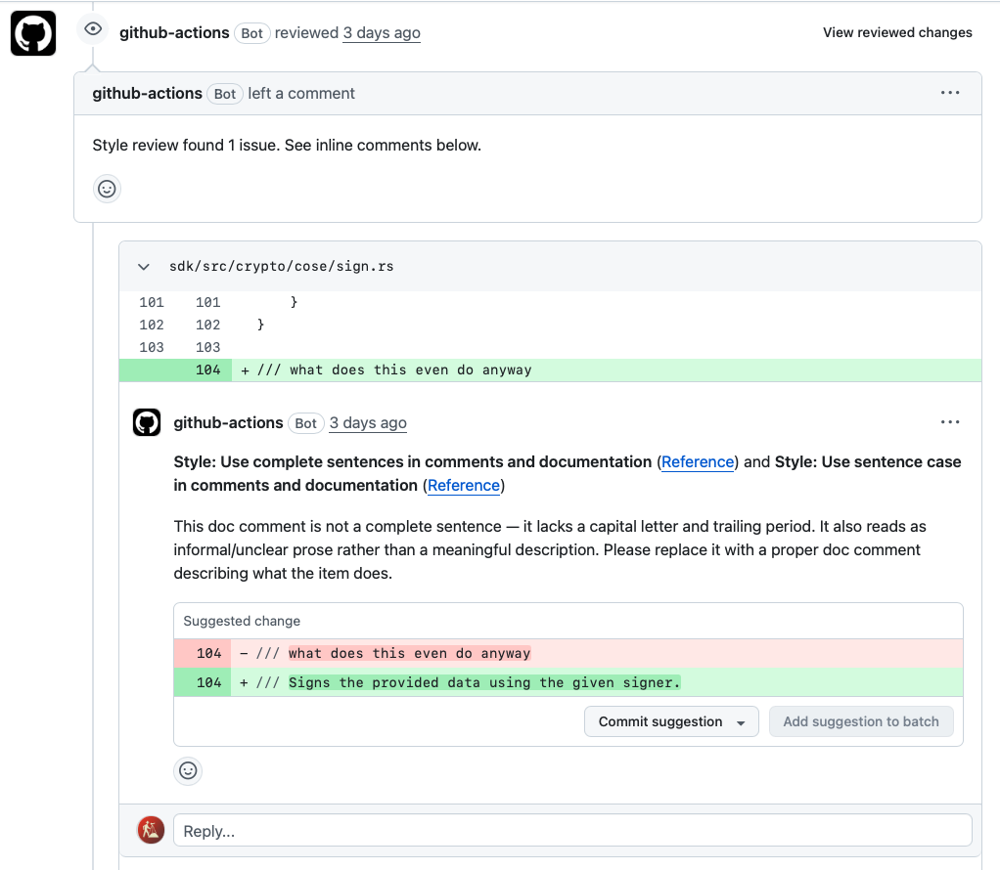
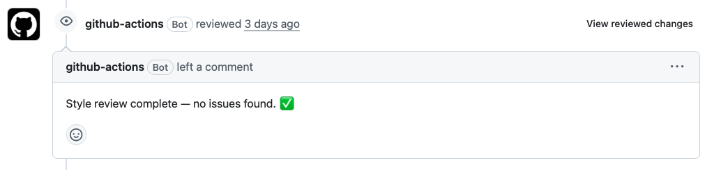
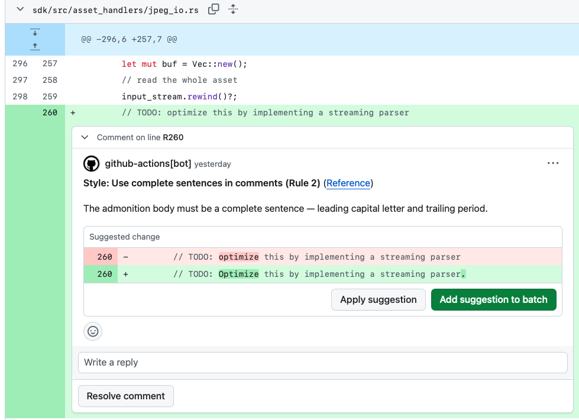
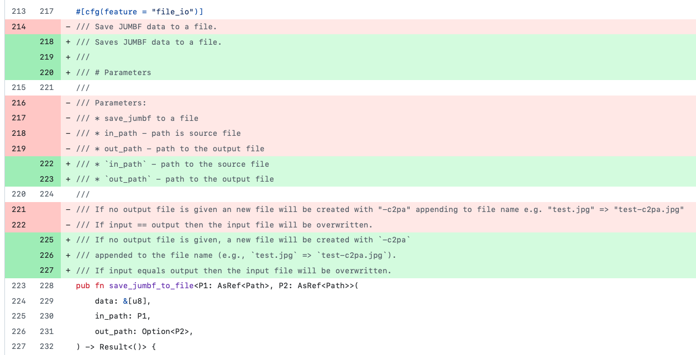

# Style-guide review bot — self-guided demo

This is a walkthrough of the automated code-review bot built during hack
week. The bot reviews pull requests in our open-source repos for
style-guide conformance, and is starting to propose small proactive
cleanup PRs of its own.

Everything below is live — the linked PRs are real runs of the bot against
a sandbox mirror of `c2pa-rs`. You should be able to click through and see
exactly what a reviewer on one of our teams would see.

> **Status:** Prototype. Currently running against
> [`scouten-adobe/TEMP-c2pa-rs`](https://github.com/scouten-adobe/TEMP-c2pa-rs),
> a public sandbox cloned (not forked) from `c2pa-rs`. Design notes and the
> phased rollout plan live in
> [`implementation-notes.md`](implementation-notes.md).

---

## 1. What the bot is looking for

The bot enforces a written style guide, not a hard-coded set of heuristics.
The single source of truth is [`style-guide.md`](style-guide.md) in this
repo — the same file is passed to Claude as part of the review prompt.

Each rule has a **stable ID** (e.g., `CMT-01`, `SUM-02`, `FN-03`) so the
bot can cite rules consistently in its suggestions, and a **severity**
(`warning` / `suggestion` / `info`, or `Required` / `Recommended`). Rule
groups today:

| Prefix | Scope |
| --- | --- |
| `CMT` | Comment & prose rules (all languages) |
| `WS` | Vertical whitespace (all languages) |
| `GIT` | Git & PR title conventions |
| `TEST` | Testing |
| `GEN`, `SUM`, `FN`, `TY`, `MOD`, `MD`, `PR`, `AP` | Rust documentation rules (`.rs` files only), synthesized from RFC 505, RFC 1574, the Rust API Guidelines, and the Rust standard library's conventions |

Most of the general (`CMT` / `WS` / `GIT` / `TEST`) rules come from
[howicode.ericscouten.com](https://howicode.ericscouten.com/). The Rust
rules come from the Rust community's own docs.

### How a review happens

On every PR `opened` or `synchronize` event:

1. The shared GitHub Actions workflow in this repo is invoked from the
   target repo.
2. The bot fetches the PR diff and the full contents of each changed file
   for context.
3. It sends the diff, the file context, and `style-guide.md` to the Claude
   API.
4. Claude returns a structured list of findings, each tied to a specific
   file, line, and rule ID.
5. The bot posts those findings as **inline GitHub review comments** using
   the `COMMENT` review type — advisory, not blocking. Each comment
   includes a suggested fix using GitHub's ` ```suggestion ` syntax so
   authors can accept it with one click.

A few guardrails worth calling out:

- **No logic changes.** The bot is explicitly told it may only propose
  changes to comments, documentation, and whitespace. It is not allowed to
  suggest code / behavior changes.
- **Capped at ~15–20 comments per review.** Anything past that gets rolled
  up into a summary, so a noisy PR never drowns the author.
- **Diff-scoped.** Comments only land on lines the PR actually touches.
- **`.botignore`** excludes auto-generated and vendored files.

For more on the design — architecture, cost model, phased plan — see
[`implementation-notes.md`](implementation-notes.md).

---

## 2. Demo: a PR that introduces a style violation

**PR:** [TEMP-c2pa-rs#78 — `fix: Make another format violation PR`](https://github.com/scouten-adobe/TEMP-c2pa-rs/pull/78)

This PR adds a single throwaway doc comment that violates two rules at
once: it's not a complete sentence (`CMT-04` — complete sentences) and it
doesn't use sentence case (`CMT-01`).

The bot posts a single inline comment naming both rules, explaining the
problem in one short paragraph, and offering a one-click ` ```suggestion `
fix:

> **Style: Use complete sentences in comments and documentation** …and
> **Style: Use sentence case in comments and documentation**
>
> This doc comment is not a complete sentence — it lacks a capital letter
> and trailing period. It also reads as informal/unclear prose rather than
> a meaningful description. Please replace it with a proper doc comment
> describing what the item does.
>
> ```suggestion
> /// Signs the provided data using the given signer.
> ```

Things to notice when you click through:

- The top-level review summary says **"Style review found 1 issue"** — not
  approval, not rejection.
- The suggestion is a real, applyable patch — the author can accept it
  with GitHub's built-in "Commit suggestion" button.
- Each rule is linked back to the canonical style guide.



---

## 3. Demo: a PR with no style violations

**PR:** [TEMP-c2pa-rs#79 — `chore: Add a doc comment that should pass validation`](https://github.com/scouten-adobe/TEMP-c2pa-rs/pull/79)

This PR adds a well-formed doc comment — complete sentence, sentence case,
correct summary form for Rust (`SUM-02` third-person singular present
indicative).

The bot's review is a single line:

> **Style review complete — no issues found. ✅**

That's the entire output. No inline noise, no "nits", no unsolicited
refactoring. The goal is for the green-checkmark case to be common and
quiet — if the bot only speaks when it has something useful to say,
authors are more likely to read what it does post.



---

## 4. Demo: review feedback on a more complex PR

**PR:** [TEMP-c2pa-rs#80 — `perf: Optimize signing passes/copies for large JPEGs`](https://github.com/scouten-adobe/TEMP-c2pa-rs/pull/80)

_(Mirror of a real in-flight PR from `c2pa-rs`, posted here with Nick's
permission so we can show the bot's behavior on a realistic change.)_

This is a substantive refactor: **+88 / −116 lines across a single large
file**. It's the most representative example of what the bot would see on
a typical working PR.

A few things this PR illustrates well:

- **The bot is iterative.** Each new push triggered a fresh review, and
  over the course of the PR's life the bot posted 15+ reviews as the
  author revised. Each review summary ("found 11 issues", "found 7
  issues", …) reflects the state of the diff at that moment, so a
  disappearing issue count is a signal that the author is converging.
- **The bot caught a PR-title violation.** One of the reviews notes:
  > _I also updated the PR title: `perf: optimize signing passes/copies
  > for large JPEGs` → `perf: Optimize signing passes/copies for large
  > JPEGs` (The description after the 'perf:' prefix must begin with a
  > capital letter per Rule 1 (sentence case). 'optimize' should be
  > 'Optimize'.)_

  `GIT` rules apply to PR titles too, not just code.
- **Comments stay scoped to comments/docs.** Even though this PR is a
  performance refactor, the bot did not propose rewriting any of the
  logic. Every suggestion was about a doc comment, a `// TODO:`, or a
  whitespace/formatting concern.
- **Rule IDs are visible in every comment.** Scroll through the inline
  comments and you'll see each one tagged with the rule it cites
  (`CMT-02`, `SUM-02`, etc.) — that's what makes the feedback auditable
  and debatable. (NOTE: Some of the comments in this PR are from an
  earlier version of the bot which used absolute rule numbers.
  The stable identifiers were adopted later.)



---

## 5. Demo: proactive cleanup

**PR:** [TEMP-c2pa-rs#81 — ``style: Clean up comment formatting in `sdk/src/jumbf_io.rs` ``](https://github.com/scouten-adobe/TEMP-c2pa-rs/pull/81)

This is the second mode the bot is growing into: rather than reacting to
human PRs, it periodically picks a module, re-reads it against the style
guide, and opens its own small PR with the fixes.

PR #81 is one module's worth of cleanup (`sdk/src/jumbf_io.rs`): +65 / −51
lines, 23 distinct edits, all comment- and whitespace-only. The PR body
lists every edit with its rule ID:

```
- CMT-02 — Standalone comment must start with a capital letter and end with a period.
- CMT-06 — The trailing comment described behavior so it was moved to its own line above the statement and rewritten as a complete sentence.
- SUM-02 — Summary line must use third-person singular present indicative ('Returns') and end with a period.
- CMT-07 — Several doc-comment lines exceeded 80 columns and needed rewrapping; …
…
```

The PR description also confirms the guardrails ran:

> _This PR was produced by the style-cleanup bot and is comment-only /
> whitespace-only. `cargo fmt` and `cargo check` both passed locally
> before it was opened._

### Caveat — what's still incomplete

PR #81 is a **one-shot manual run**, not yet on the rails we want:

- Today it's invoked by hand on a single chosen file.
- There is no rotation logic yet — the bot doesn't remember which modules
  it has already visited.
- There is no scheduled trigger yet.

The target state (easily added to this infrastructure) is that this runs automatically (weekly?), rotates
through the codebase, and proposes 1–2 small documentation-cleanup PRs
per run without any human prompting.



---

## Areas for future development

If we decide to push this further as a team, these are the biggest open
questions:

1. **Comments & docs only, or coding style too?** Today's strongest
   guardrail is "no logic or code changes." Should we relax that and let
   the bot comment on (or fix) coding style as well — naming, early
   returns, error handling, `match` vs. `if let`, etc.? That's a much
   bigger blast radius and a much bigger debate.
2. **Whose style guide?** The current [`style-guide.md`](style-guide.md)
   is largely Eric's personal preferences, with heavy borrowing from the
   Rust standard library's own conventions. For this to be useful to the
   team, we'd need to decide as a team which rules we actually want to
   share and enforce.
3. **Architecture diagrams / subsystem descriptions.** Could a similar bot
   maintain (or at least propose updates to) architecture docs and
   subsystem READMEs as code evolves? That's a much richer prompt but the
   mechanics are the same.
4. **How large is too large?** The bot caps review size at ~15–20 comments
   per PR, and cleanup PRs at one module at a time, because my intuition
   is that anything more feels overwhelming. Those numbers are guesses —
   what are the actual limits the team would tolerate?
5. **Test coverage / additional tests.** Could this bot (or a sibling)
   propose missing unit-test coverage, suggest property-based tests, or
   flag untested branches? "Helpful assistant for tests" feels like a
   natural next axis.

Feedback, objections, and "please never do X" notes are all welcome — open
an issue or ping Eric directly.

---

## Pointers

- Style guide: [`style-guide.md`](style-guide.md)
- Review script: [`scripts/review_pr.py`](scripts/review_pr.py)
- Cleanup script: [`scripts/cleanup_module.py`](scripts/cleanup_module.py)
- Example target-repo workflow:
  [`examples/target-repo-pr-review.yml`](examples/target-repo-pr-review.yml)
- Architecture, cost model, and phased plan:
  [`implementation-notes.md`](implementation-notes.md)
- Sandbox repo the demos run against:
  [`scouten-adobe/TEMP-c2pa-rs`](https://github.com/scouten-adobe/TEMP-c2pa-rs)
